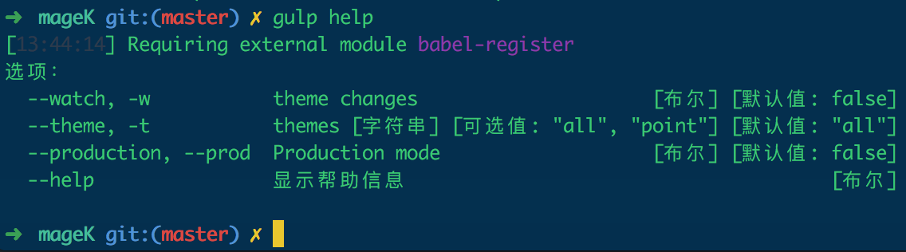

# mageK


[]() []()

本插件为了提高Magento2前端主题开发,对Magento2自动化工具做了扩展,基于gulp开发,集成JS编译,Less,
phtml检查,图片压缩等等不必要重复工作,缩短前端开发时间,工程化开发.

+ [支持多area和多theme](#moreAreaAndTheme)
+ [快速生成主题结构](#gulpInit)
+ [支持强大的生产力ES6语言](#Compile)
+ [编译压缩JS,Less,Image](#Compile)
+ 友好与magento的Grunt结合使用

## [nodejs环境](https://github.com/creationix/nvm)

## 安装
在你的Magento的dev目录下clone本项目

```bash
cd <Magento root dir>/dev
git clone git@github.com:pointline/mageK.git
```

## 安装gulp-cli
全局安装gulp-cli用以驱动gulp.babel.js文件

```javascript
npm i -g gulp-cli
```

如果是国内网速可能会安装过慢或失败,建议添加淘宝镜像[`cnpm`](https://npm.taobao.org/)进行安装

## 安装模块依赖

```bash
cd mageK
npm install
```

## 命令及使用

<a href="moreAreaAndTheme"></a>
### 初始化主题
配置mageK/build/configs/themes.js,有插件支持多area和多theme,这个地方可以配置多个

```javascript
point: { //主题标识
  name: 'Point name', // 主题名
  area: 'frontend', // 主题区域 可选 adminhtml | frontend
  src: 'Pointline/point' // VendorName/theme
}
```

<a href="#gulpInit"></a>
### gulp init
在mageK项目下执行

```javascript
gulp init
```

😄😄 会看到在mageK目录下会新生成theme.js当中配置的文件夹,不用担心,后面就在mageK目录下编辑主题,
同步到magento的默认主题目录

你会看到生成的主题目录中自动创建了magento的常用模块目录以及更多的文件和文件夹

<a href="Compile"></a>
### gulp default

```javascript
gulp
```

这里可以省略default,默认执行default,会自动编译主题下面的所有文件并同步到magento主题目录,这个命令会用到很多

现在就可以到后台去配置 Content > Design > Themes 应用主题,是不是少去了很多不必要的操作,省下大把时间,加上后台配置最多2分钟生成可使用主题结构

### gulp clean
清除magento默认主题目录下的文件,并不会清除magek下面的主题文件

```javascript
gulp clean
```

### gulp help
查看命令可选参数,根据可选参数传入不同的值

```javascript
gulp help
```


### 命令参数
### --watch或--w
--watch可以简写为--w

--watch的作用可以单独监听某类文件进行编译同步,不用`gulp default`那样去执行所有文件同步,效率会提高很多,
并且在修改js或css这类文件时,如果文件有错会及时报错的命令行

```javascript
gulp --watch js
gulp --watch css
gulp --w js
gulp --w css
```

通过`gulp help`可以查看到`--watch`的可选参数

### --theme或--t
--theme可以简写为--t

--theme由于本扩展支持多area和多theme,为了性能的考虑可以指定`--theme`单独指定,对某个主题执行上面的操作

通过`gulp help`可以查看到`--theme`的可选参数,这里的可选参数会根据配置的theme.js变化

### --production或--prod
--production可以简写为--prod

这个参数一般等到上线时会使用,会对js,css,image等资源进行压缩,本扩展对ES5,ES6都支持不错😄

```javascript
gulp --prod
```

### 例子:

```javascript
// 编译所有主题下面的所有资源文件
gulp
// 编译point主题下的所有资源文件
gulp --t point
// watch编译point主题下面的js文件
gulp --t point --w js
// watch编译point主题下面的css文件
gulp --t point --w css
// 压缩point主题的js,css,图片等资源
gulp --t point -p
```

# License
Copyright (c) 2017 Point Line

This software is released under the MIT License. See [LICENSE](./LICENSE).
